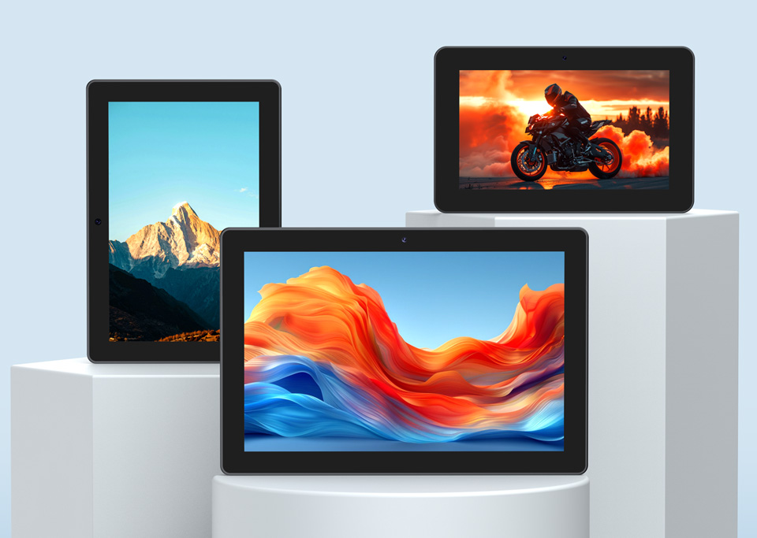

  <h1>ESP32-P4-WIFI6-Touch-LCD-X</h1>
  
<strong>ESP32-P4 7 / 8 / 10.1-inch MIPI-DSI touch display development boards</strong>

  

    
    
    
  

  

    <a href="README_ZH.md">中文</a> ·
    <a href="https://www.waveshare.com/esp32-p4-wifi6-touch-lcd-7-8-10.1.htm">🌐 Product Page</a> ·
    <a href="https://docs.waveshare.com/ESP32-P4-WIFI6-Touch-LCD-X">📚 Documentation</a> ·
    <a href="firmware/">📦 Factory Firmware</a> ·
    <a href="examples/esp-idf/">🧩 ESP-IDF Examples</a> ·
    <a href="examples/arduino/">🔧 Arduino Examples</a>
  

  

    
  

---

## ✨ Overview

The ESP32-P4-WIFI6-Touch-LCD-X series combines an ESP32-P4 multimedia
processor, an ESP32-C6 wireless coprocessor, and a capacitive MIPI-DSI touch
display in an all-in-one HMI platform. The family is available with 7, 8, and
10.1-inch displays for smart-home terminals, industrial controls, edge
computing, multimedia, and interactive UI applications.

This repository contains first-party ESP-IDF and Arduino examples, factory
flashing images, and board schematics. Refer to the official product page for
current specifications and package contents.

## 📋 Product Variants

| Product | Display | Controller | SKU |
| --- | --- | --- | ---: |
| [ESP32-P4-WIFI6-Touch-LCD-7](https://www.waveshare.com/esp32-p4-wifi6-touch-lcd-7-8-10.1.htm?sku=30738) | 7-inch, 720 × 1280 | ILI9881C | 30738 |
| [ESP32-P4-WIFI6-Touch-LCD-8](https://www.waveshare.com/esp32-p4-wifi6-touch-lcd-7-8-10.1.htm?sku=33673) | 8-inch, 800 × 1280 | JD9365 | 33673 |
| [ESP32-P4-WIFI6-Touch-LCD-10.1](https://www.waveshare.com/esp32-p4-wifi6-touch-lcd-7-8-10.1.htm?sku=33672) | 10.1-inch, 800 × 1280 | JD9365 | 33672 |

All three variants use a two-lane MIPI-DSI display interface and a GT9271
10-point capacitive touch controller. Display orientation is configurable in
software.

## 🖥️ Hardware Overview

| Feature | Device / interface |
| --- | --- |
| Main processor | ESP32-P4NRW32 with dual-core high-performance RISC-V and single-core low-power RISC-V processors |
| Memory | 32 MB in-package PSRAM and 32 MB onboard NOR Flash |
| Wireless | ESP32-C6-MINI-1U-H8 over SDIO, providing 2.4 GHz Wi-Fi 6 and Bluetooth 5 LE ([hosted Wi-Fi compatibility](docs/p4-c6-hosted-wifi.md)) |
| Display | 7 / 8 / 10.1-inch IPS panel over two-lane MIPI-DSI |
| Touch | GT9271 capacitive touch controller with 10-point touch |
| Camera | Onboard 5 MP OV5647 front camera over two-lane MIPI-CSI |
| Audio | ES8311 audio codec, ES7210 echo-cancellation circuit, dual microphones, and speaker |
| Storage | MicroSD card slot over SDIO 3.0 |
| USB | USB-to-UART Type-C port and USB 2.0 OTG High-Speed Type-C port |
| Expansion | 40-pin header, battery connector, camera/display connectors, and board-to-board interfaces |

For GPIO assignments and circuit details, use the repository schematics:

- [ESP32-P4-WIFI6-Touch-LCD-X schematic](schematic/ESP32-P4-WIFI6-Touch-LCD-X-Schematic.pdf)
- [ESP32-P4-Connect-Adapter schematic](schematic/ESP32-P4-Connect-Adapter-Schematic.pdf)

## 🚀 Getting Started

1. Choose the product variant that matches your display.
2. Follow the official [ESP-IDF setup and example
   guide](https://docs.waveshare.com/ESP32-P4-WIFI6-Touch-LCD-X/Development-Environment-Setup-IDF).
3. Open a project under [`examples/esp-idf/`](examples/esp-idf/), set the
   target to `esp32p4`, and review its README or configuration options. The
   examples default to ESP32-P4 Rev3.x; use the explicit
   [silicon-revision profile](docs/silicon-revisions.md) only for older Rev1.3
   hardware.
4. For display examples, select the correct panel under
   `Board Support Package (ESP32-P4) > Display > Select LCD type` in
   `menuconfig`.
5. Build, flash, and monitor the selected example using the ESP-IDF tools
   described in the official documentation.

Some multimedia examples require additional hardware or media files. Review
the example-specific notes before flashing.

## 🧪 ESP-IDF Examples

| Example | Focus |
| --- | --- |
| [`01_HowToCreateProject`](examples/esp-idf/01_HowToCreateProject/) | Minimal ESP-IDF project template |
| [`02_HelloWorld`](examples/esp-idf/02_HelloWorld/) | Basic application and chip information |
| [`03_i2c_tools`](examples/esp-idf/03_i2c_tools/) | Interactive I2C bus tools |
| [`04_wifistation`](examples/esp-idf/04_wifistation/) | Wi-Fi station through the ESP32-C6 hosted connection |
| [`05_sdmmc`](examples/esp-idf/05_sdmmc/) | MicroSD card access over SDMMC |
| [`06_I2SCodec`](examples/esp-idf/06_I2SCodec/) | ES8311 codec and I2S audio |
| [`07_Displaycolorbar`](examples/esp-idf/07_Displaycolorbar/) | MIPI-DSI display color bars |
| [`08_lvgl_demo_v9`](examples/esp-idf/08_lvgl_demo_v9/) | LVGL 9 display and touch demo |
| [`09_video_lcd_display`](examples/esp-idf/09_video_lcd_display/) | MIPI-CSI camera preview on the LCD |
| [`10_mp4_player`](examples/esp-idf/10_mp4_player/) | MP4 / AVI media playback; check the example hardware notes |
| [`11_esp_brookesia_phone`](examples/esp-idf/11_esp_brookesia_phone/) | ESP-Brookesia phone-style UI |
| [`12_usb_extend_screen`](examples/esp-idf/12_usb_extend_screen/) | USB extended display, touch, and audio functions |

## 🔧 Arduino

[`examples/arduino/`](examples/arduino/) provides 10 first-party sketches for
display, touch, text, LVGL 9, hosted Wi-Fi analysis, camera preview and ISP
tuning, MicroSD, audio playback, and microphone capture. They follow the
LCD-5 bundled-library layout: `GFX_Library_for_Arduino`, `displays`, LVGL
`9.3.0`, and `lv_conf.h`. All 10 sketches are compile-checked for LCD-7,
LCD-8, and LCD-10.1. See the [Arduino examples
guide](examples/arduino/README.md) for the complete sketch list, peripheral
assignments, exact Arduino-ESP32 `3.3.11` FQBN, and variant build command.

The display reset is GPIO27. Touch `INT` and `RST` are intentionally left as
`GPIO_NUM_NC`; the library probes `0x5D` followed by `0x14`, binds the actual
responding address, and uses polling only. A compile result does not verify
that display or touch behavior on hardware.

## 🤖 Continuous Integration

The [ESP-IDF examples
workflow](https://github.com/waveshareteam/ESP32-P4-WIFI6-Touch-LCD-X/actions/workflows/esp-idf-examples.yml)
discovers the 12 first-party projects and builds each one for `esp32p4` with
ESP-IDF `v5.5.5` and `v6.0.2`. The six display examples are expanded for the
7-inch, 8-inch, and 10.1-inch display variants, producing 48 source-build rows
in a full run. Only `04_wifistation` and `05_sdmmc` use their non-empty
`sdkconfig.ci` overlay; display rows also use their selected LCD overlay.
ESP-IDF v5.5.5 rows compile only; the 18 v6.0.2 display rows upload source-built
[CI artifacts](docs/ci-artifacts.md) retained for 14 days. All 48 rows and all
18 downloadable example artifacts use the `rev3_x` profile. Rev1.3 and Rev3.x
are mutually exclusive ESP-IDF build targets; see
[ESP32-P4 Silicon Revisions](docs/silicon-revisions.md) before building for an
older board.
The separate documentation workflow applies a complete Markdown gate for
ownership, bilingual companions and language-correct links, homepage symmetry,
local links, and public-text privacy. It also verifies docs-only scope, so the
discovery job remains visible for every pull request while documentation-only
and factory-firmware-only changes select no example builds. A fixed-name
`ESP-IDF CI gate` combines discovery with any selected matrix builds, so the
workflow has one stable result for branch-protection rules.

The [Arduino examples
workflow](https://github.com/waveshareteam/ESP32-P4-WIFI6-Touch-LCD-X/actions/workflows/arduino-examples.yml)
compiles the 10 Arduino sketches with Arduino CLI `1.5.1` and Arduino-ESP32
`3.3.11` for all three display variants (30 rows). It uses the `postv3`
ESP32-P4 board profile, is compile-only, and does not publish firmware or
downloadable build artifacts. `05_GFX_ESPWiFiAnalyzer` requires compatible hosted
firmware on the ESP32-C6 coprocessor when run on hardware; see [hosted Wi-Fi
compatibility](docs/p4-c6-hosted-wifi.md).

Factory binaries are excluded from source-build discovery. See
[Component Ownership](docs/components.md) for the boundary between local board
glue, embedded upstream code, and managed-component candidates.
The 11 phone-style example is compile-covered only; its 7-inch hardware/UI has
not been verified and this repository does not add a 720x1280-specific stylesheet.

## 📦 Factory Firmware

The default ESP-Brookesia firmware source is available under
[`firmware/brookesia/`](firmware/brookesia/). The Rev3.x merged factory images
built from that source are:

- `ESP32-P4-WIFI6-Touch-LCD-7-FactoryOnly-260820.bin`
- `ESP32-P4-WIFI6-Touch-LCD-8-FactoryOnly-260820.bin`
- `ESP32-P4-WIFI6-Touch-LCD-10.1-FactoryOnly-260820.bin`

Use only the image that matches your hardware and ESP32-P4 Rev3.x. Superseded
fixed-name FactoryOnly images have been removed; only the current dated images
are kept. These binaries are separate from source-built CI artifacts. See the official
[resources and
documents](https://docs.waveshare.com/ESP32-P4-WIFI6-Touch-LCD-X/Resources-And-Documents)
for the flash download tool and related materials.

## 🗂️ Repository Layout

| Path | Purpose |
| --- | --- |
| [`examples/esp-idf/`](examples/esp-idf/) | First-party ESP-IDF projects |
| [`examples/arduino/`](examples/arduino/) | First-party Arduino sketches and bundled LCD-5-style libraries |
| [`firmware/`](firmware/) | Factory flashing binaries and default firmware source |
| [`docs/`](docs/) | Compatibility and maintainer notes |
| [`schematic/`](schematic/) | Board and adapter schematics |
| [`assets/`](assets/) | Product images used by the documentation |
| [`.github/`](.github/) | CI workflows and example discovery tools |

## 🤝 Support and Contributions

Contributions and reproducible issue reports are welcome. Include the product
variant, hardware revision if known, example path, ESP-IDF version,
reproduction steps, expected behavior, actual behavior, and relevant serial
logs.

- [Open an issue](https://github.com/waveshareteam/ESP32-P4-WIFI6-Touch-LCD-X/issues)
- [Contributing guidelines](CONTRIBUTING.md)
- [Support](SUPPORT.md)
- [Waveshare support](https://service.waveshare.com/)
- [English documentation](https://docs.waveshare.com/ESP32-P4-WIFI6-Touch-LCD-X)
- [中文文档](https://docs.waveshare.net/ESP32-P4-WIFI6-Touch-LCD-X/)

## 📄 License

This repository is licensed under the Apache License 2.0. See
[`LICENSE.txt`](LICENSE.txt).
